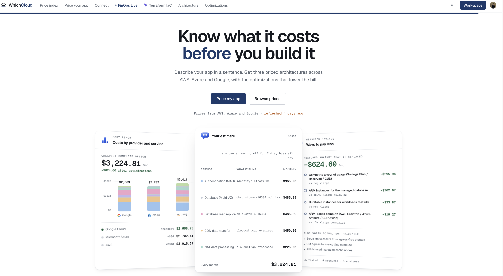
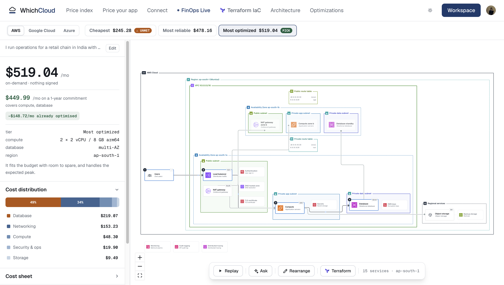
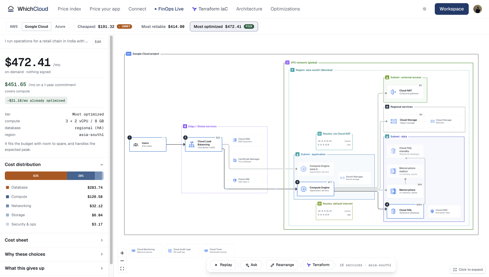
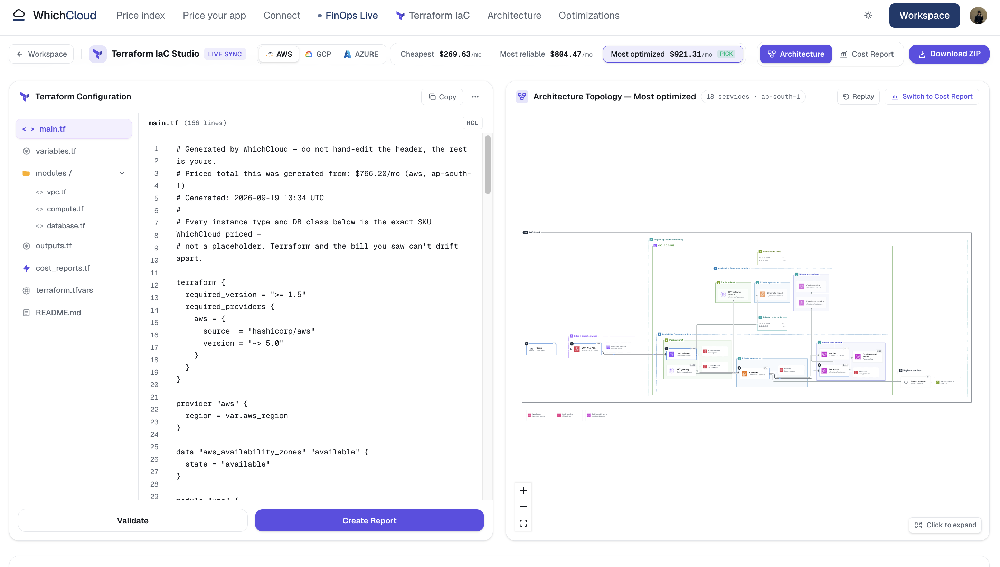
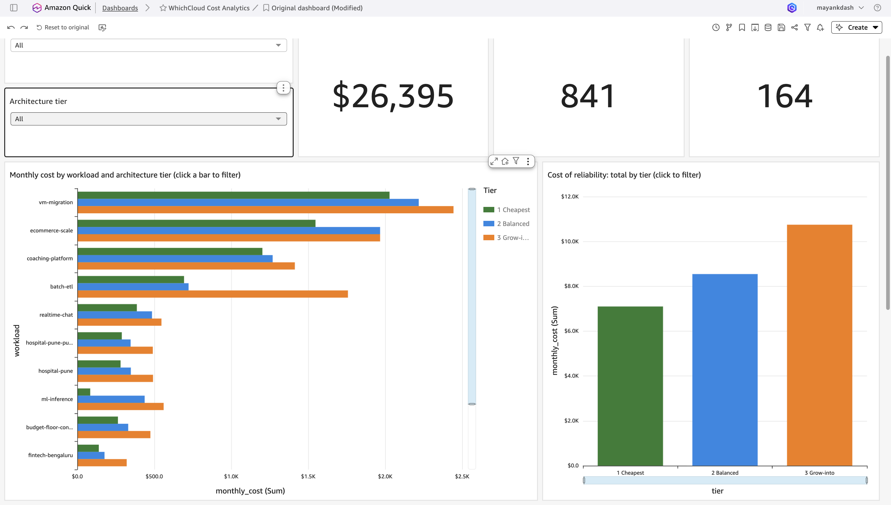
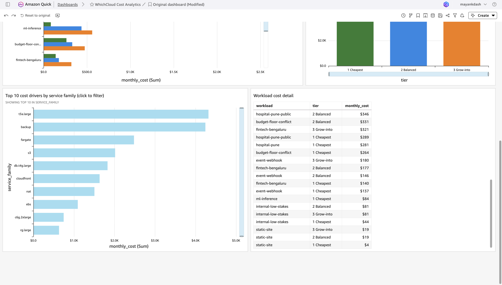
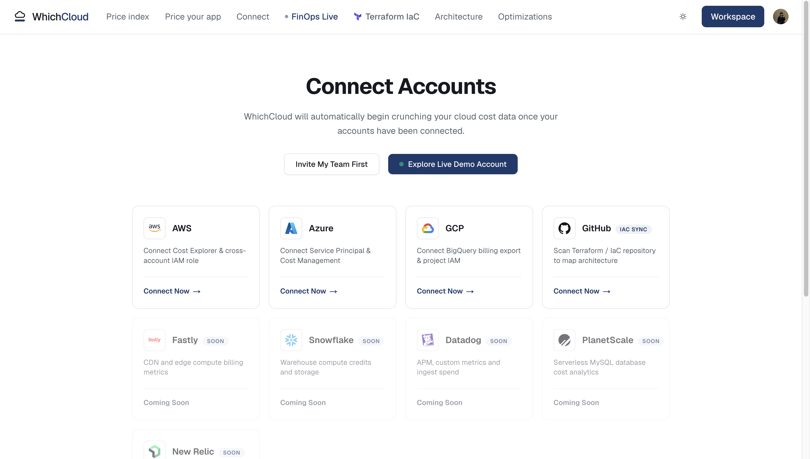
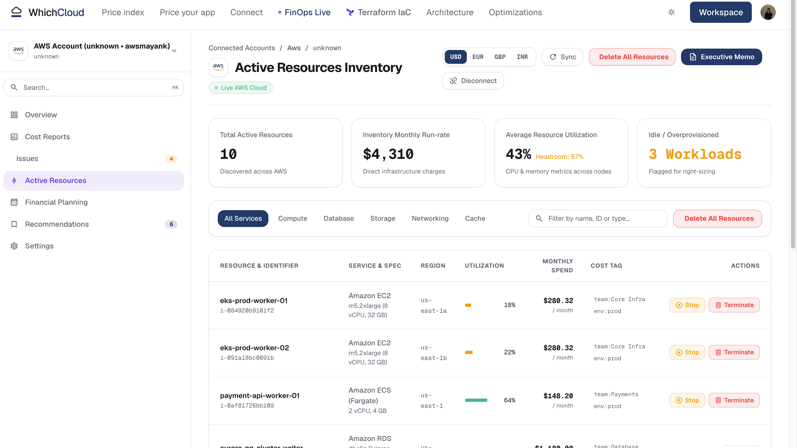

<div align="center">

# WhichCloud

### Know what it costs before you build it

Describe your app in one sentence. Get three priced cloud architectures across
**AWS, Google Cloud and Azure**, with real line-item pricing, architecture diagrams,
deployable Terraform and the optimizations that lower the bill.

**[Live demo: whichcloud.vercel.app](https://whichcloud.vercel.app)**




</div>

---

## Highlights

- **Real pricing, not LLM guesses.** Prices are ingested from the AWS, Azure and
  Google pricing APIs into PostgreSQL. Every line item shows the SKU, quantity and
  unit price it came from.
- **Three architectures per cloud.** Cheapest, Most reliable and Most optimized,
  each with a cost breakdown, a diagram and the trade-offs it makes.
- **Terraform generated from the priced design.** The exact instance types and
  database classes that were priced are the ones written to Terraform, so the
  estimate and the deployment cannot drift apart.
- **25 optimization techniques** (Graviton/ARM, spot, commitments, scale-to-zero,
  egress-free storage...) with measured savings against the option they replace.
- **Cost analytics on AWS.** Engine output analysed with Amazon S3, Athena (SQL)
  and an interactive Amazon QuickSight dashboard, built as code.
- **Tested like production.** 746 automated Pytest tests passing, plus a regression
  harness that runs 13 benchmark workloads against recorded golden cost totals.

## Screenshots

### Architecture with per-service costs

| AWS (ap-south-1, Mumbai) | Google Cloud (asia-south1, Mumbai) |
|---|---|
|  |  |

Region, VPC, subnets, route tables and every service, with its monthly cost, the
cost distribution and the 1-year commitment price.

### Terraform IaC Studio



Generated `main.tf`, variables, modules (VPC, compute, database) and outputs next to
the architecture topology, with validate and download as ZIP.

### Cost analytics dashboard (Amazon QuickSight)




841 priced line items from 13 benchmark workloads, exported to S3, queried with
Athena and explored in an interactive QuickSight dashboard (workload and tier
filters, click any bar to filter everything). Details: [`analytics/`](analytics/README.md)

What the data shows:

- Average monthly cost per workload rises from **$546** (Cheapest) to **$657**
  (Balanced) to **$827** (Grow-into): reliability adds about **51%** end to end.
- Compute and backups are the two biggest cost drivers.
- 164 of 841 line items cost $0 (free tier or included in another service).

### Account connections and FinOps workspace (UI preview)

| Connect accounts | FinOps resource inventory |
|---|---|
|  |  |

*The FinOps views currently run on built-in sample data to demonstrate the workflow.*

## How it works

```
Plain-English requirement
   -> LLM extracts a structured requirement (or pass it directly; no LLM needed)
   -> Engine + knowledge base choose services, sizing and optimizations
   -> Pricing engine costs every line item from provider price catalogs (PostgreSQL)
   -> Three options per cloud: Cheapest / Most reliable / Most optimized
   -> Architecture diagram + Terraform for AWS, Google Cloud and Azure
```

## Tech stack

| Layer | Tools |
|---|---|
| Backend | Python, FastAPI, PostgreSQL, Redis |
| Frontend | Next.js, React |
| Cloud & IaC | AWS, Google Cloud, Azure, Terraform |
| Analytics | Amazon S3, Amazon Athena, Amazon QuickSight |
| Testing | Pytest, golden-total regression harness |
| Deployment | Vercel (frontend), Docker Compose (local data services) |

## Repo structure

```
WhichCloud/
├── backend/          # FastAPI: engine, pricing, Terraform generators, tests
├── frontend/         # Next.js: pricing, architecture, Terraform and FinOps views
├── knowledge-base/   # 25 optimization techniques + AWS/GCP/Azure service mappings
├── analytics/        # S3 + Athena + QuickSight cost analytics (dashboard as code)
├── diagrams/         # Generated reference architecture diagrams
├── infra/            # docker-compose: PostgreSQL, Redis
└── docs/             # PRD, resource map, screenshots
```

## Run locally

```bash
cd backend
python3 -m venv .venv && .venv/bin/pip install -e .
docker compose -f ../infra/docker-compose.yml up -d        # PostgreSQL + Redis
.venv/bin/python scripts/ingest_prices.py --region india   # load provider prices
.venv/bin/python scripts/recommend.py --goal "e-commerce site" --scale medium --spiky --budget 400
.venv/bin/python -m pytest -q                              # run the test suite
```

Full guide: [`backend/README.md`](backend/README.md)

## Docs

- [Product Requirements (PRD)](docs/PRD.md)
- [Resource Map](docs/RESOURCES.md)
- [Knowledge Base schema](knowledge-base/README.md)
- [Cost analytics](analytics/README.md)

## Author

**Mayank Thakur** · Cloud & DevOps Engineer ·
[LinkedIn](https://www.linkedin.com/in/mayankthakur1) ·
[GitHub](https://github.com/itzmayank01)
